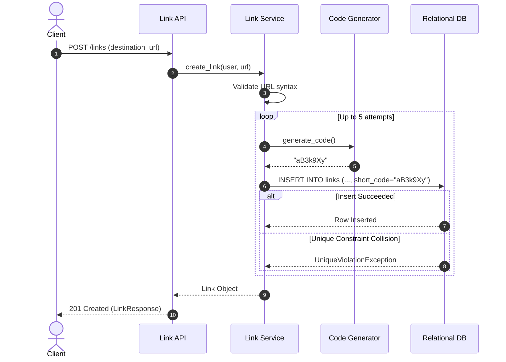

# Specification 02: Short Link Creation

- **Spec ID**: `SPEC-02`
- **Component**: Link Service & API Module
- **Traceability**: [docs/architecture.md](file:///e:/Web%203.0/Generative%20AI/Github/linklet/docs/architecture.md) — FR-01, FR-08, FR-09, FR-10, FR-11, Section 11, Section 12.1
- **Status**: Ready for Implementation

---

## 1. Overview & Objective

The Short Link Creation module handles the creation of shortened URLs for authenticated users. It validates the destination URL syntax, generates a secure 7-character Base62 candidate short code, coordinates collision retry logic with the relational database unique constraint, and integrates with the idempotency engine for mutation safety.

---

## 2. API Endpoint Specification

### `POST /links`

Creates a new short link mapping for the authenticated user.

- **Authentication**: Required (`Authorization: Bearer <token>`)
- **Headers**:
  - `Content-Type: application/json`
  - `Idempotency-Key`: Optional string (UUID or client key, max 255 chars)
- **Request Body**: `LinkCreateRequest`
  ```json
  {
    "destination_url": "https://example.com/very/long/url/path?query=1"
  }
  ```
- **Response**: `201 Created` with `LinkResponse`

### Success Response Body (`LinkResponse`)
```json
{
  "link_id": "9b1deb4d-3b7d-4bad-9bdd-2b0d7b3dcb6d",
  "destination_url": "https://example.com/very/long/url/path?query=1",
  "short_code": "aB3k9Xy",
  "total_clicks": 0,
  "created_on": "2026-08-31T17:00:00Z"
}
```

---

## 3. URL Validation Rules (FR-08)

The `URL Validator` component must check the `destination_url` before processing:

1. Must be a syntactically valid URI per RFC 3986.
2. Must have an absolute scheme: ONLY `http` or `https` are permitted (`ftp://`, `javascript:`, `file://`, etc. MUST be rejected).
3. Must contain a non-empty hostname.
4. Total URL length MUST NOT exceed 2,048 characters.

#### Error Response (`400 Bad Request` or `422 Unprocessable Entity`):
```json
{
  "error": {
    "code": "INVALID_DESTINATION_URL",
    "message": "Destination URL must be a valid absolute HTTP or HTTPS URL.",
    "details": null
  }
}
```

---

## 4. Short Code Generator Algorithm (FR-09)

The candidate code generation must follow Base62 encoding rules:

1. **Alphabet**: Base62 character set `[0-9a-zA-Z]` (62 possible characters).
2. **Length**: Exactly 7 characters (provides $62^7 \approx 3.52 \times 10^{12}$ distinct codes).
3. **Randomness**: Cryptographically secure random selection (`secrets.choice`).
4. **Pure Function**: The short code generator is stateless and has no database dependency.

---

## 5. Collision Retry & Persistence Flow (FR-09, Section 12.1)

To guarantee uniqueness without expensive check-before-insert races:

1. Generate candidate `short_code` using Short Code Generator.
2. Attempt DB insertion into `links` table within a transaction.
3. If insertion fails with a database `UNIQUE(short_code)` constraint violation:
   - Catch the database exception.
   - Retry generation up to a maximum of **5 retry attempts**.
4. If 5 consecutive attempts fail due to collision (statistically negligible), abort transaction and return `500 Internal Server Error` with error code `SHORT_CODE_GENERATION_FAILED`.



---

## 6. Idempotency Integration (FR-10, FR-11)

If the `Idempotency-Key` header is provided by the client:
1. Scope key by `user_id` and operation (`CREATE`).
2. Compute SHA-256 hash of `LinkCreateRequest` JSON payload.
3. Execute within the unified transaction described in [05-idempotency-engine.md](file:///e:/Web%203.0/Generative%20AI/Github/linklet/specs/05-idempotency-engine.md).

---

## 7. Test & Acceptance Criteria

| ID | Scenario | Input / Action | Expected Result |
|----|----------|----------------|-----------------|
| `TC-CREATE-01` | Valid Creation | Valid HTTP destination URL | `201 Created`, valid `LinkResponse` with `total_clicks: 0` |
| `TC-CREATE-02` | HTTPS Creation | Valid HTTPS destination URL | `201 Created`, destination URL preserved |
| `TC-CREATE-03` | Invalid Scheme | Destination URL `ftp://example.com` | `400 Bad Request`, code `INVALID_DESTINATION_URL` |
| `TC-CREATE-04` | Malformed URL | Destination URL `not_a_url` | `400 Bad Request`, code `INVALID_DESTINATION_URL` |
| `TC-CREATE-05` | Unauthenticated | `POST /links` without Bearer token | `401 Unauthorized` |
| `TC-CREATE-06` | DB Collision Handled | Mock candidate generator to collision on 1st try | System retries, produces non-colliding 2nd candidate, returns `201 Created` |
| `TC-CREATE-07` | Idempotent Replay | Repeat `POST /links` with same `Idempotency-Key` & payload | Replays original `201 Created` response without inserting 2nd link row |
