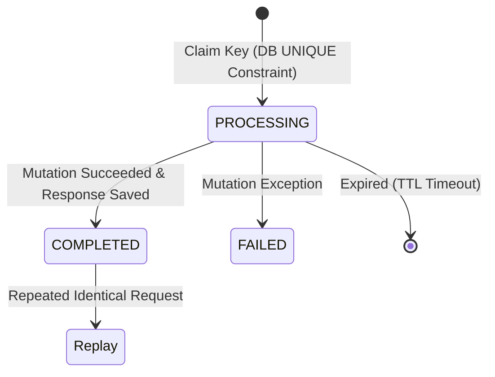

# Specification 05: Mutation Idempotency Engine

- **Spec ID**: `SPEC-05`
- **Component**: Idempotency Middleware / Repository
- **Traceability**: [docs/architecture.md](file:///e:/Web%203.0/Generative%20AI/Github/linklet/docs/architecture.md) — FR-10, FR-11, Section 8, Section 9, Section 13
- **Status**: Ready for Implementation

---

## 1. Overview & Objective

The Idempotency Engine ensures that state-mutating requests (`CREATE`, `DELETE`, `REGENERATE`) containing an `Idempotency-Key` header are executed at most once. It protects clients against network timeouts, lost HTTP responses, and duplicate submissions while detecting idempotency key misuse across payload mismatches.

---

## 2. Key Scoping & Payload Hashing

1. **Scoped Uniqueness**: An idempotency key is scoped by `(user_id, operation, idempotency_key)` to isolate client keys between different users and operations.
   - `user_id`: Authenticated User UUID.
   - `operation`: Enum string `CREATE` | `DELETE` | `REGENERATE`.
   - `idempotency_key`: Client-supplied header string (e.g., UUIDv4, max 255 chars).
2. **Payload Hash**: Compute a SHA-256 hex digest of the raw canonical request body:
   $$\text{request\_hash} = \text{SHA-256}(\text{CanonicalJSON}(\text{Request Payload}))$$
   For requests without a body (`DELETE`), use an empty string hash.

---

## 3. Idempotency State Machine

The idempotency record transitions through three discrete states stored in the `idempotency_request` table:



### State Behavior Table

| Current Status | Request Hash Match | System Action | HTTP Response |
|----------------|--------------------|---------------|---------------|
| **Not Found** | N/A | Insert `PROCESSING` record & proceed to execute mutation | Processed normally |
| **COMPLETED** | **Match** | Replay stored `response_code` and `response_body` | Replayed original result |
| **COMPLETED** | **Mismatch** | Reject as invalid key reuse (FR-11) | `400 Bad Request` or `422 Unprocessable Entity` |
| **PROCESSING** | **Match or Mismatch** | Request currently in progress or stalled | `429 Too Many Requests` or `409 Conflict` |
| **FAILED** | **Match** | Retry permitted or replay stored failure | `500` or retry execution |
| **Expired `PROCESSING`**| N/A | Expiration TTL reached (`now() > expires_at`); reclaim key | Re-execute mutation |

---

## 4. Single-Transaction Atomicity Guarantee (Section 9.1)

To prevent partial state corruption where a business mutation commits but the idempotency record is lost (or vice versa):

1. **Unified Transaction**: The business state mutation (`INSERT links` or `UPDATE links` or `DELETE links`) and the `idempotency_request` state update MUST occur within the **same relational database transaction**.
2. **Commit Flow**:
   ```sql
   BEGIN TRANSACTION;
   -- 1. Lock/claim idempotency row (status = 'PROCESSING')
   -- 2. Execute business mutation (e.g., INSERT INTO links...)
   -- 3. Update idempotency row (status = 'COMPLETED', response_code = 201, response_body = '...')
   COMMIT;
   ```

---

## 5. Idempotency Key Misuse Error Contract (FR-11)

When a client reuses an existing idempotency key with a different request payload, the API MUST reject the request:

```json
{
  "error": {
    "code": "IDEMPOTENCY_KEY_MISUSE",
    "message": "The idempotency key has already been used with a different request payload.",
    "details": null
  }
}
```

---

## 6. Expiration & Recovery Semantics (Section 19.2)

- **TTL Expiration**: Each idempotency record receives an `expires_at` timestamp set to **24 hours** from creation (`created_at + INTERVAL '24 hours'`).
- **Processing Timeout**: A `PROCESSING` record older than **30 seconds** is considered orphaned/stalled. A retried request MAY reclaim an expired `PROCESSING` record by updating its status to `PROCESSING` with a new timestamp.

---

## 7. Test & Acceptance Criteria

| ID | Scenario | Input / Action | Expected Result |
|----|----------|----------------|-----------------|
| `TC-IDEM-01` | First Time Key Execution | New key + payload | Request processed, `COMPLETED` record saved in DB |
| `TC-IDEM-02` | Identical Retry Replay | Same key + same payload | `201 Created` replayed from DB without duplicate insert |
| `TC-IDEM-03` | Mismatched Payload Reuse | Same key + different payload | `400 Bad Request`, code `IDEMPOTENCY_KEY_MISUSE` |
| `TC-IDEM-04` | Cross-User Key Isolation | User A & User B use same key string | Both requests processed independently (keys scoped by user) |
| `TC-IDEM-05` | Cross-Operation Key Isolation | Same key for `CREATE` and `DELETE` | Both requests processed independently (keys scoped by operation) |
| `TC-IDEM-06` | In-Flight Lock Conflict | Concurrent requests with same key | 1st succeeds, 2nd receives `429` / `409` lock error |
| `TC-IDEM-07` | Transactional Rollback | Business logic fails during creation | Idempotency transaction rolls back cleanly |
